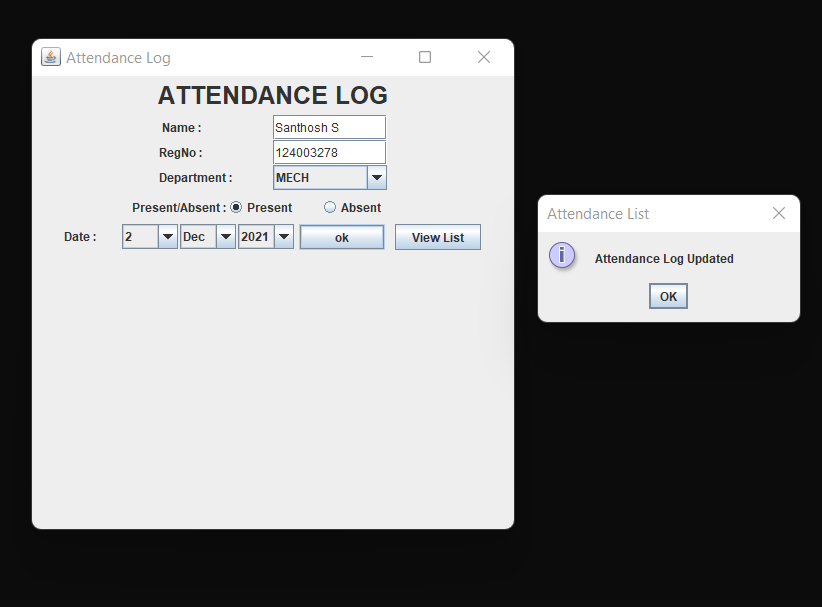

# SwingPractice

This is a Attendance List application built using Java Swing.

## Usage

 * Clone the repository or Download the .zip file from [here](https://github.com/Santhoshkumar32/SwingPractice/archive/refs/heads/main.zip)
 * Extract the folder SwingPractice-main and navigate to the base root.
 * In the terminal, run the command java attendance.UserInput

## Preview
   Screenshot of the output screen ,when empty field is inserted 
   
   
   Screenshot of the output window,when all the fields are inserted
   
 
